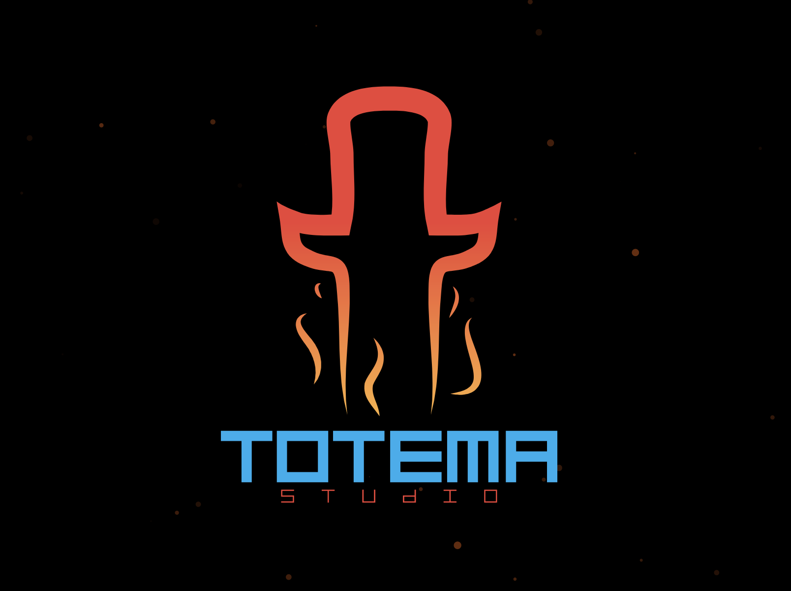

# Bienvenue à la compétition de développement Jeu Vidéo pour CS Games 2023!

Contexte: Les vagues battent contre les murs, les nuages sont lourds et obscurs, et tous regardent l’horizon avec peur. Quelle chose pourra nous retourner l’espoir…? Les jeux vidéo, bien sûr! et c’est votre responsabilité de les créer!

Points totales de la compétition: 1800 

La compétition dure 6 heures, divisée en 2 parties de 3 heures chacune. La compétition comporte la réalisation de nouvelles fonctionnalités sur 2 mini-jeux Unity (un jeu 2D et un 3D) basiquement découpées en 5 niveaux, 3 de base, et 2 bonus. Chacun des 3 niveaux de base augmentera la complexité de la fonctionnalité en question et équivaudra à 240 Points. Par contre, les niveaux bonus vous donneront 90 Points supplémentaires.
Vous aurons besoin de compétences sur Unity et C#. De plus, chaque compétiteur doit créer un compte gratuit Unity et un compte Github. La propreté du code est toujours prise en compte pour l'évaluation. Vous pouvez utiliser des librairies supplémentaires tant qu’elles sont acceptées par les directeurs. 

## Mini-Jeu 1: 2D
  Dans ce premier mini-jeu, qui aura lieu dans la première moitié, nous vous demandons de faire la création de la logique de comportement des entités ennemies sur un plan 2D.

Éléments Base (240 points chacun):
Niveau 1 : Ennemi suit un parcours (créer un pattern de patrouille) 
Niveau 2 : Détection du joueur, arrêt de la patrouille et déclenchement de la poursuite (suivre au joueur) 				
Niveau 3 : Si joueur perdu de vue, période d’investigation puis retour au comportement initial (patrouille) 						
Éléments Bonus (90 points chacun):
Niveau 4 (bonus) : Si un ennemi repère le joueur, tous les autres le poursuivent (effet de communication entre les ennemis)			
Niveau 5 (bonus) : “PathFinding”, trouver des chemins autour des obstacles.  

## Mini-Jeu 2: 3D
  Pour le deuxième mini-jeu, vous devrez implémenter des armes pour un jeu FPS, nous vous fournirons avec une classe abstraite “Weapon” qui vous pouvez utiliser comme base.

Éléments Base (240 points chacun):
Niveau 1 : Arme peut être utilisé et donne du feedback au joueur.
Niveau 2 : Détection de cibles
Niveau 3 : Munition finie et action de recharger (recharger peut être automatique au moment que la munition finisse)
Éléments Bonus (90 points chacun):
Niveau 4 (bonus) : Deuxième arme avec fonctionnalité distincte.
Niveau 5 (bonus) : système de rotation entre les armes.  

## Prérequis

- [Unity 2021.3.14f1](https://unity.com/releases/editor/whats-new/2021.3.14#release-notes)
- Ce projet Unity utilise la configuration de base 2D URP

## Dans ce projet

* [Assets](Assets/): Contient les assets du projet
* [.github/workflows](.github/workflows/): Contient les fichiers de configuration de Github Actions (GameCI)

## Configuration GameCI GitHub Actions

Ce projet contient un workflow [GameCI](https://game.ci/) de base pour compiler le projet à l'aide de Github Actions. Pour plus d'information sur l'utilisation de GameCI avec Github Actions, voir la [Documentation GameCI](https://game.ci/docs/github/getting-started).

### Activation

Si vous désirez utiliser GameCI pour ce projet, il vous suffit d'accomplir [la partie "Activation" de la documentation GameCI](https://game.ci/docs/github/activation). Vous n'avez qu'à suivre la partie [Personal license - Converting into a license](https://game.ci/docs/github/activation#converting-into-a-license) de la documentation. Vous aurez besoin d'un compte Unity (courriel et mot de passe)

Dans les réglages Github Actions, vous devriez avoir les secrets suivants:

* `UNITY_LICENSE`: Le contenu du fichier `Unity_v2021.x.ulf` (voir [Personal license - Converting into a license](https://game.ci/docs/github/activation#converting-into-a-license))
* `UNITY_EMAIL`: Votre courriel Unity
* `UNITY_PASSWORD`: Votre mot de passe Unity

## Projet d'exemple créé par

**[Totema Studio](https://totemastudio.com/)**

