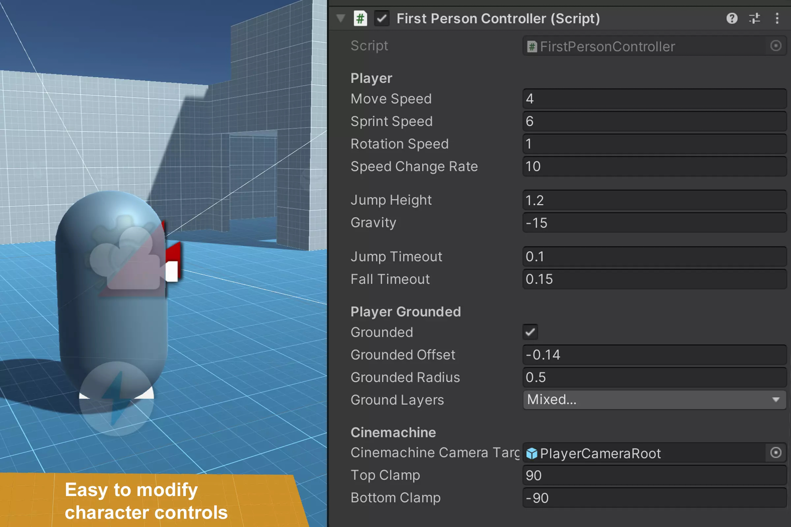
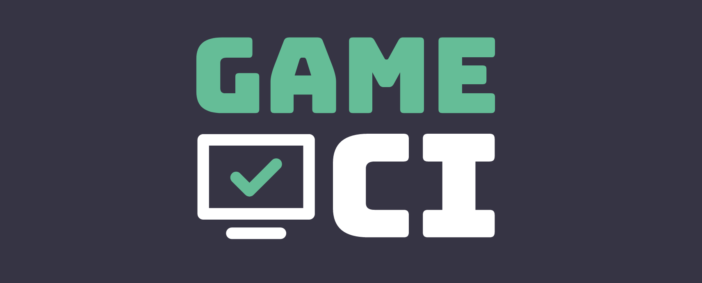
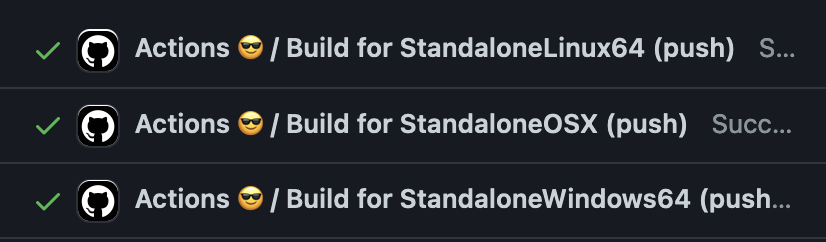
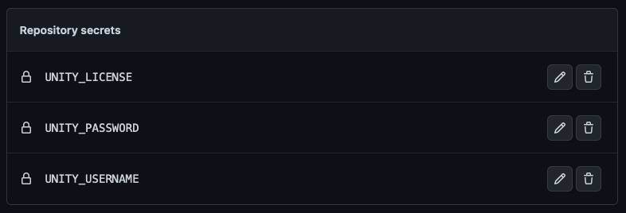
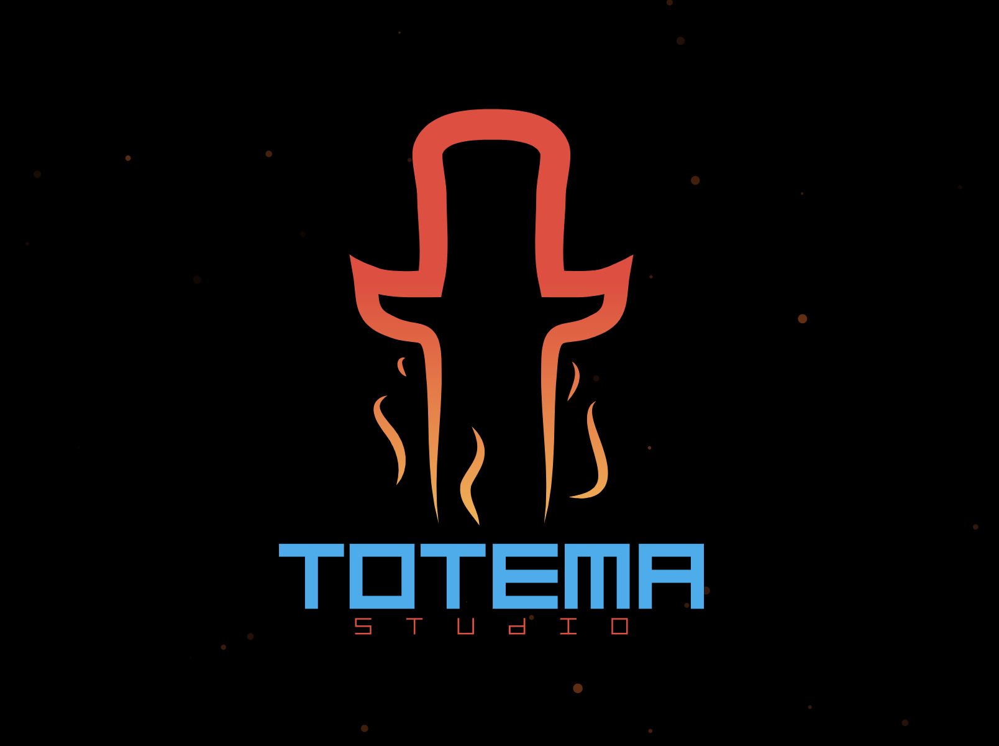


 # Welcome to the Game Dev competition for CSgames 2023!

Context: the waves crash against wall, the clouds are heavy and dark, and everyone looks at the horizion with fear. What could return hope to us...? Video Games, of course! and its your responsibility to create them!

Total Points: 1800 

The competition lasts 6 hours total, divided in two 3 hour blocks. The competition is based on the creation of new fonctionalities on 2 pre-made Unity projects (one 2D and one 3D). Each fonctionality is devided in 5 levels, 3 basic ones and 2 bonus ones. Each of the 3 basic levels increase the complexity of the fonctionality, and are worth 240 points. On the other hand, the bonus levels are only worth 90 points each. You will need the be cmpetent in Unity et c#. Also, each competitor needs a free Unity and Github account. How clean and legible the code is will be taken in consideration for grading. you can use extra libraries as long as they are accepted by the director.  

## Mini-game 1: 2D
In this first mini-game, you must create the logic used by enemies in a 2D plane. 

Base Levels (240 points):
Level 1 : Ennemy follows a pathh (patrol). 
Level 2 : Detects the player, stops the patrol and follows player.		
Level 3 : If the player is too far away, search for it, and if not found, return to patrol. 						
Bonus Levels (90 points chacun):
Level 4 (bonus) : If one enemy detects the player, other nearby enemies will also be alerted.		
Level 5 (bonus) : “PathFinding”, find a way around obstacles.

## Mini-game 2: 3D
In this second mini-game, you must implement weapons for an FPS game.

Base Levels (240 points chacun):
Level 1 : Weapon can be used and has feedback.
Level 2 : Weapon detects hits.
Level 3 : finite ammo, and reload system (reload can be done automatically).
Bonus Levels (90 points chacun):
Level 4 (bonus) : Second weapon with distict fonctionality.
Level 5 (bonus) : System of swapping weapons.  

## Prerequisits

- [Unity 2021.3.14f1](https://unity.com/releases/editor/whats-new/2021.3.14#release-notes)
Ce projet Unity utilise la configuration de base URP et le [Starter Assets - First Person Character Controller](https://assetstore.unity.com/packages/essentials/starter-assets-first-person-character-controller-196525)

## In this projet

* [Assets](Assets/): Contains the assets of the projet
* [Assets/StarterAssets](Assets/StarterAssets/): Contains the assets of [Starter Assets - First Person Character Controller](https://assetstore.unity.com/packages/essentials/starter-assets-first-person-character-controller-196525)
* [.github/workflows](.github/workflows/): Contains les fichiers de configuration de Github Actions (GameCI)

## Configuration GameCI GitHub Actions

This projet contains a workflow [GameCI](https://game.ci/) to compile the projet with the help of Github Actions. For more information on the use of GameCI with Github Actions, see [Documentation GameCI](https://game.ci/docs/github/getting-started).

### Activation

if you want to use GameCI for this projet, you must do [the "Activation" part of the documentation GameCI](https://game.ci/docs/github/activation). You only need to follow the part of [Personal license - Converting into a license](https://game.ci/docs/github/activation#converting-into-a-license). You will need an Unity account.

In the Github Actions configuration, you must add these secrets:

* `UNITY_LICENSE`: Contents of the file `Unity_v2021.x.ulf` (voir [Personal license - Converting into a license](https://game.ci/docs/github/activation#converting-into-a-license))
* `UNITY_EMAIL`: Unity email
* `UNITY_PASSWORD`: Unity password

## Projet created by:

**[Totema Studio](https://totemastudio.com/)**

